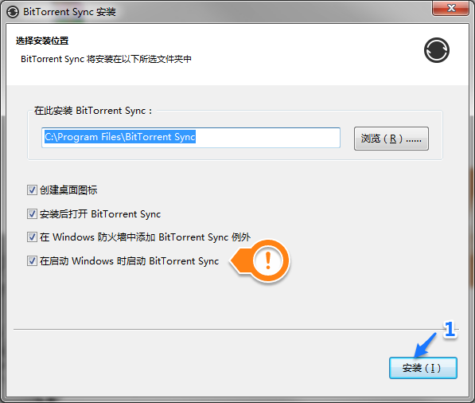

# BitTorrent Sync使用手册
----

Sync可实现设备到设备的同步，为团队及个人提供快速私人的文件共享。

## 1. 幼儿园应用场景（共享小朋友在幼儿园的照片）

利用该软件可以将教师拍摄的小朋友在幼儿园的照片简单的与家长共享，且**无需上传至任何服务器**。

* 教师端需做工作
  1. 安装并配置Sync软件；
  2. 添加共享文件夹，并将共享密钥或链接发送给家长；
  3. 按需要在文件夹中添加需要共享的文件或文件夹；

* 家长端需做工作
  1. 安装并配置Sync软件；
  2. 将老师发来的共享密钥或链接添加到Sync软件中；
  3. 等待传输；
  4. 欣赏小朋友在幼儿园的照片；

## 2. Sync使用基本过程
  1. 安装Sync程序；
  2. 配置Sync程序（创建身份或连接已有身份）；
  3. 共享或连接他人共享文件夹；

## 3. Sync的特点
* 速度快

  只同步已改变的内容，而不是整个文件。每一个额外设备都在为新设备提供共享。

  

* 无容量限制

  文件夹没有大小限制，同步文件夹全部内容。

  

* 真正私人

  文件不会存在服务器上，只会在任何的设备之间同步，同步不需要身份认证，无需账号，无需密码。

  

* 端到端加密

  在传送中所有数据以AES-128加密并且通过基于SSL的连接传递。Sync使用PKI密钥对识别身份，比起电邮/密码组合更安全。

  

* 多系统，跨平台

  Sync不仅支持主流计算机操作系统，例如Windows, MAC, Linux，还支持主流移动终端系统，如iOS，Android，以及其他设备，例如Western Digital，QNAP，Synology等设备。

  支持的操作系统及设备参考https://www.getsync.com/intl/zh_cn/platforms/desktop。
  

## 4. 安装及使用方法
根据自己所使用的平台下载最新版本Sync软件。下载地址如下：
> https://www.getsync.com/intl/zh_cn/platforms/desktop

### 4.1 安装
#### 4.1.1. Windows
**STEP1**：双击已下载的安装程序包。

  

**STEP2**：按默认参数安装BitTorrent Sync。

  

> **注意：** 为保证同步过程能顺利进行，建议勾选`在启动Windows时启动BitTorrent Sync`。另外如有其它防火墙请自行添加防火墙例外，否则可能影响同步。

**STEP3**：等待BitTorrent Sync安装完成后，自动运行Sync软件。出现欢迎界面，点击`使用此应用程序，即代表您同意我们的隐私权政策、条款和最终用户许可协议.`后，点击`继续 >`。

  

出现试用Sync Pro界面，点击`继续 >`。关于Sync Pro，参考https://www.getsync.com/intl/zh_cn/features#bfm。

  

#### 4.1.2. iOS
**STEP1**：在App Store中搜索`BitTorrent Sync`。

  

**STEP2**：点击`获取`安装BitTorrent Sync。

  

#### 4.1.3. Android
**STEP1**：在`豌豆荚`应用商店中搜索`BitTorrent Sync`。

  

**STEP2**：点击`安装`安装BitTorrent Sync。

  

<b>至此，您已经在设备上完成了Sync软件的安装。</b>
 
 
 

### 4.2. 配置Sync软件

当第一次运行Sync软件时需要创建或将当前设备连接到某个Sync设备上，也就是创建或连接到某个身份上。

Windows平台下Sync 2.0首次运行：

  

移动终端下Sync首次运行界面（此处以iOS系统例）：

  

  > **连接设备**
  >
  > 连接设备是指通过Sync秘密身份，将**个人的**多台设备联系在一起，使得他们之间的同步文件夹列表可以互相同步，共同管理同步文件夹。

#### 4.2.1. 这是我的第一台Sync 2.0设备（**您没有运行Sync的设备，选择此项**）

通过点击`这是我的第一台Sync 2.0设备`来创建一个身份。

通过创建的身份可创建一个自己的`身份`，在将来可将自己的多台设备联系起来。同时在发送和接受数据时显示这个名字。

> **注意：** 名称可任意，不需要考虑是否与他人重复，此名称一经选择，不能进行更改。

此处创建了一个名为`Demo`的身份，在文本框填写`DEMO`后，点击`创建身份`。

  

#### 4.2.2. 连接一台已经在运行Sync 2.0的设备（**您已有运行的Sync设备，选择此项**）

通过此项您可以将自己的多台运行Sync的设备连接在一起，可以在任何一台上连接到一个共享文件夹，其他设备都能看到这个连接。

将多台设备连接到一起后，可以将移动终端设备的照片备份到任意台自己的设备中。

通过点击`连接一台已经在运行Sync 2.0的设备`

##### 4.2.2.1 移动终端

移动终端点击`连接一台已经在运行Sync 2.0的设备`后，出现扫描界面（**可能有请求相机的权限，请允许**），扫描一台已经连接身份的设备提供的二维码。

获取二维码的方法：

1. 点击菜单中`我的设备`，如下图：

  

2. 点击`连接设备`，如下图：

  

3. 出现二维码，如下图：并使用移动终端扫描同时连接到设备。

  

##### 4.2.2.2 Windows 终端

Windows终端点击`连接一台已经在运行Sync 2.0的设备`后，出现二维码，如下图，通过已经连接或创建身份的移动设备中的`连接设备`功能扫描该二维码，Windows终端即连接的已创建的身份。

  

### 4.3. 共享文件夹

#### 4.3.1. 点击`添加文件夹`按钮

  

#### 4.3.2. 选择要共享的文件夹

  

#### 4.3.3. 设置权限，并创建共享

  

  **权限：**

  只读，各同步设备不能修改同步文件夹内容。（只由一人维护共享文件夹）

  读写，各同步设备均可以修改同步文件夹内容。（多人维护共享文件夹）

  **安全性：**

  取消默认的需要批准设置。

  链接将于此时长过期，表示将在有期内可由其他终端添加，超出有效期后将失效，不能被添加。

#### 4.3.4. 分享共享链接

Sync提供3种分享方式，`电子邮件`，`复制`和`QR码`（二维码）。

  

> 鉴于老师采用**飞信**方式通知家长事宜，亦采取`复制`的方式进行分享，将复制的链接通过飞信发送给儿童家长。

分享链接是一段类似于`https://link.getsync.com/#f=Demo&sz=0&t=2&s=UDGLNJHTNHKXCZVGNSZGK5FKQCNFDFGH6PIARKOXAXEXECSMBTVA&i=CX65QTVNK7M74QSF4IF7O6WQJEY5R44T5&e=1426862032&v=2.0`的地址。

### 4.4. 连接到已共享的文件夹

#### 4.4.1. Windows

1. 点击菜单中的`手动连接...`功能，如下图：

  

2. 在出现的对话框中填写老师分享的链接，参考`4.3.4`，点击`下一步`。

  

3. 设置本地保存路径和同步方式，点击`连接`。

  

>  `同步所有`建议使用`ON`状态，将共享源的所有文件及变化自动同步到本地。

## 5. 友情提示
* 由于Sync是在运行时完成设备之间同步的，因此需要各设备之间有共同的同步时间。建议开机后保持Sync的运行。

  

* 由于可能同步的数据量比较大，建议移动终端禁用`手机网络数据`功能。

  

* 移除共享文件夹时，如勾选`删除已同步文件`将会将本地的同步文件夹删除，请确认是否要删除，小心误删文件。

## 6. 联系方式

如果对Sync的使用有什么疑问，可与我联系，我非常愿意和你一起探讨。

Email: wding.cn@gmail.com

微信: lainding （`加微信请注明是谁。`）

微信二维码：

